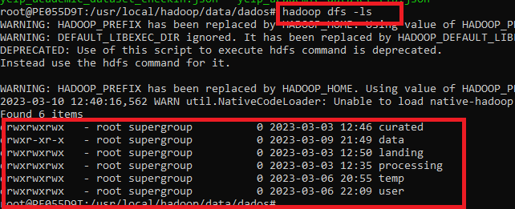
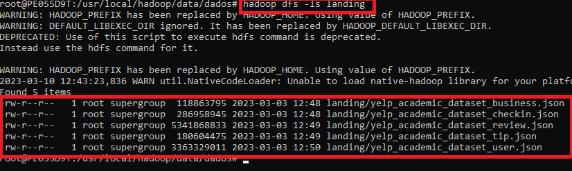

### FRANCISCO JAIME DA SILVA

## Projeto Engenharia de dados Datalake Simples Hadooop/HDFS

O projeto consiste em criar um data lake no Hadoop HDFS e fazer upload de dados para atestar o funcionamento.

---

### Etapas do Projeto

1. Foi instlado o WSL para permitir baixar usar o linux(Ubuntu20.04)
2. Foi Instalado e configurado ambeinte Hadoop Single node.
3 . Foram criados o diretórios abaixo no HDFS
<ul>
  <li>landing - Landing zone ou Zona de Pouso(dados em formato bruto)</li>
  - hadoop dfs -mkdir -p /usr/local/hadoop/data/dados/landing
  <li>processing - Processing zone(dados pre-processados)</li>
  - hadoop dfs -mkdir -p /usr/local/hadoop/data/dados/landing
  <li>curated - Curated zone(Dados limpos, agregados e prontos para análises)</li>  
</ul> 

4.Foi realizado o upload dos arquivos de dados na zona de pouso(landing), extraídos do kaggle
https://www.kaggle.com/datasets/yelp-dataset/yelp-dataset
<ul>
  <li>yelp_academic_dataset_businessjson</li>  
  <li>Tyelp_academic_dataset_checkin.json</li>
  <li>yelp_academic_dataset_review.json</li>
  <li>yelp_academic_dataset_tip.json</li>
  <li>yelp_academic_dataset_user.json</li>
</ul> 

5. Foi feita a listagem dos arquivos para validar o funcionamento 

